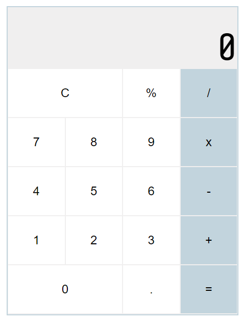

# Basic Calculator
## Web-based calculator written in HTML, CSS, and JavaScript

Try it out [here](https://rjgallego.github.io/calculator-app/)!

### Summary
This web-based calculator was written purely in CSS, HTML, and Javascript. You can add, subtract, divide, or multiply several operations in consecutively until the equals or clear button is selected. You can also calcuate with decimal numbers using the decimal point. The '%' button will also allow you to convert the current entered value to a percentage.

### Author
Rheanna Pena - [LinkedIn](https://www.linkedin.com/in/rheanna-gallego-aa0007110/)
